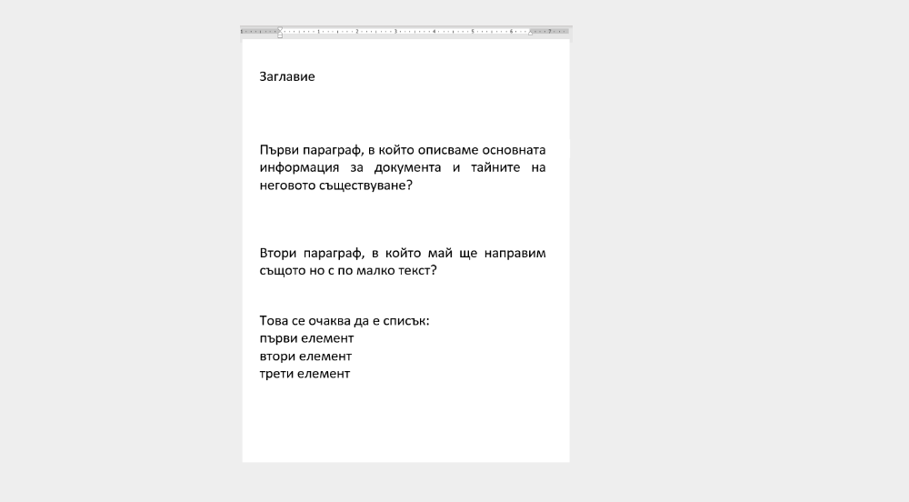
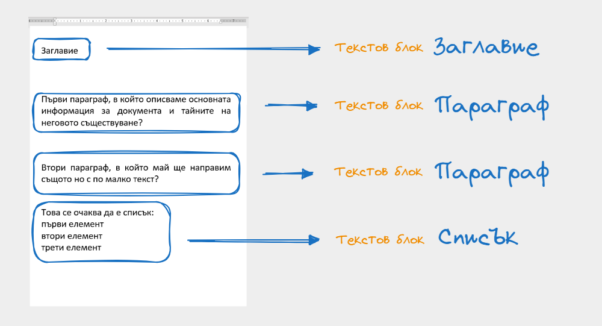
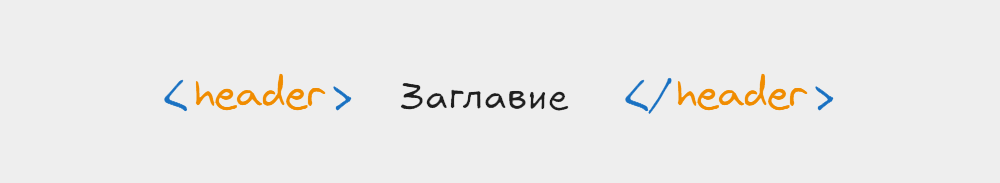
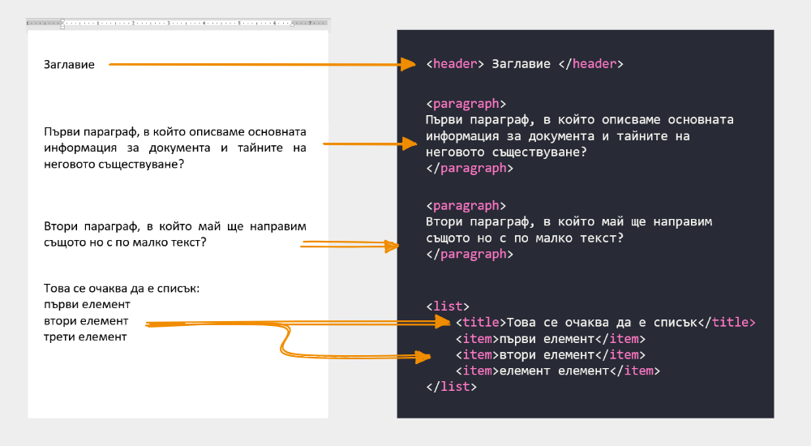
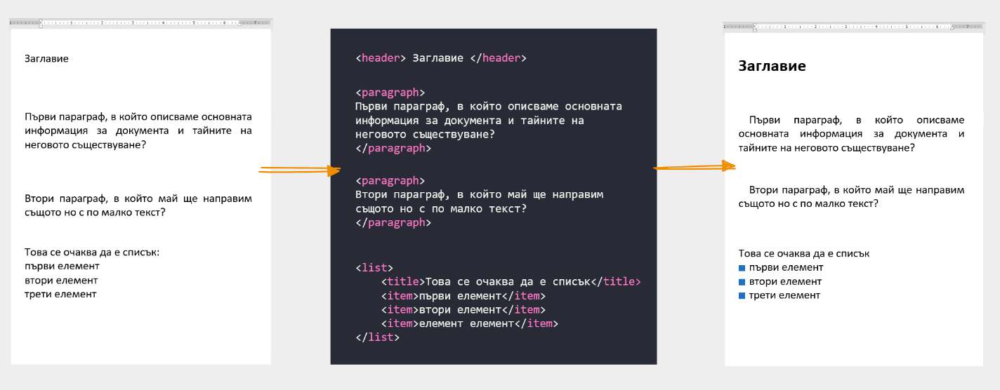
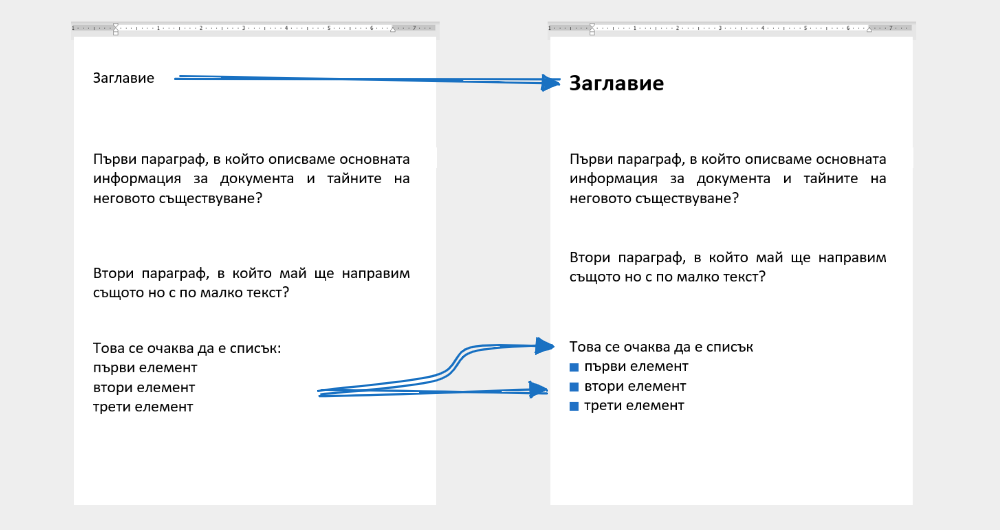
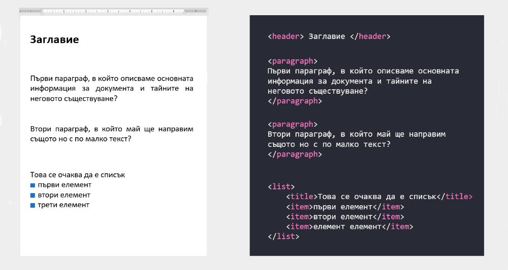

# За какво ни е HTML и CSS
Интернет страниците много приличат по своята идея да белите листа, върху които си водим записки. Понеже вече рядко караме ръцете си да дъргат химикалки, нека вземем за пример текстов документ, разписан в Word.

Ако имате дори минамален опит с ползването на софтуер за обработка на текст, ще ви направи силно впечатление че текста които виждаме в примера е **неподреден** / **неформатиран**. Автора се е постарал да напише какво е имал предвид когато е излял мислите си върху електронната хартия, но ние можем да поклатим само глава и да кажем че:
- заглавието не прилича на заглавие
- параграфите са ок, но нямат отстояние и подравняване
- а този списък не е ясно къде започва и къде свършва. 

Подсъзнателно знаем, какво е искал да каже автора, но системата в този случай WORD няма никаква идея. За нея това са просто текстови блокове. Макар че зад тях седи намерението на автора.

Тук е най-важния момент. **От къде** ние знаем какво всъщност означават тези параграфи. Амиии - можем да четем това е достатъчно. Да, нооо за компютъра тази задача е доста по трудна отколкото за нас - изкуствения интелект е изцяло нова материя, така че трябва да намерим начин да му подскажем че заглавието, списъка и параграфа са елементи, които имат значение и за него. 

### Как да подскажем на компютъра какво представляват текстовите блокове ?
Както вече се разбрахме текста няма никаква стойност за компютъра, за да подсказваме трябва да измислим набор от - специални ключови думички, които да сложим пред или зад текста. Когато срещнем тези думички ще знаем че съдържанието между тях е специален текст. Например:
- ключова дума **header** - каза че това е заглавие;
- ключова дума **paragraph** - ще подсказва на компютъра, че това е параграф;
- ключова дума **list** - ще подсказва на компютъра, че това е неподреден списък.

<!-- картинка -->

Следващия ни важен въпрос е как да ги запишем така че да се получават грешки. Не може да сложим ключовата дума просто пред текста, трябва да има някакъв вид разделение. Така например ако искаме да подскажем,на компютъра че текста е заглавие - нека това заглавие да е заградено отпред и от зад с ключовата дума **header** но и с допълнителни символи, които няма как да се ползват в тази комбинация в никакъв текст който бихме написали някога. 

Следвайти тази логика можем да създадем двойка от ключови думи, с която да обрагим всеки един текстов блок, който разгледахме:
- <header>ТЕКСТОВ БЛОК</header>
- <paragraph>ТЕКСТОВ БЛОК</paragraph>
- <list>ТЕКСТОВ БЛОК</list>

Ако обградим всеки един текстов блок с кореспондиращите ключови думи, ще получим следния резултат.

По този начин вече компютъра има информация, какво виждаме ние в тези текстови блокове. Имайки вече тази информация - можем да инструктираме компютъра да визуализира, форматира и като цяло украси текста по малко по различен начин:
- нека заглавията винаги да са с по-едър шрифт и почернени, така че да привличат вниманието
- нека списъците имат отличителни фигурни пред всеки един елемент
- нека параграфите започват с отстояние

<!-- 

 -->